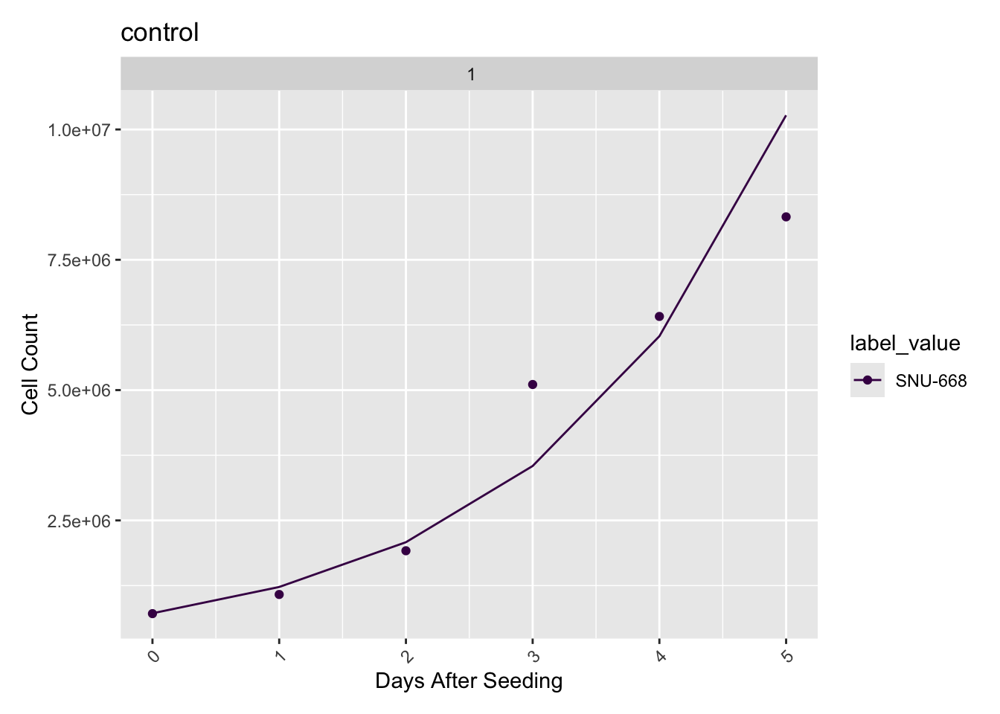
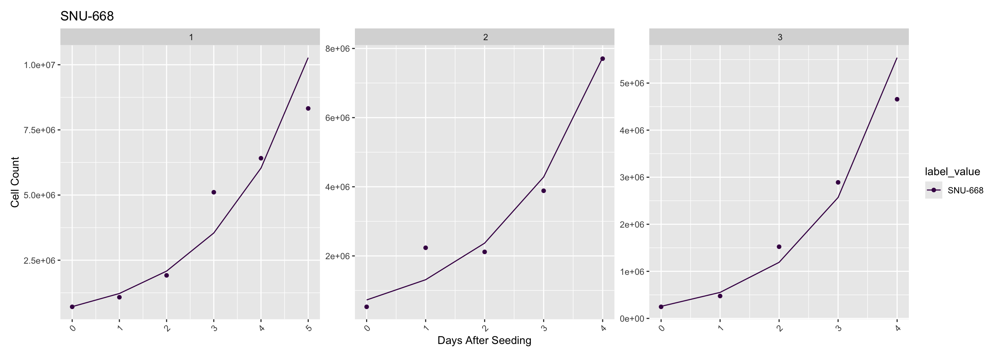
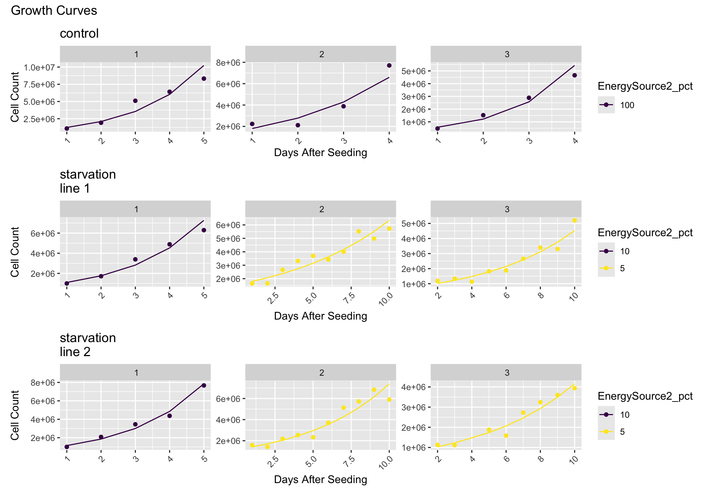
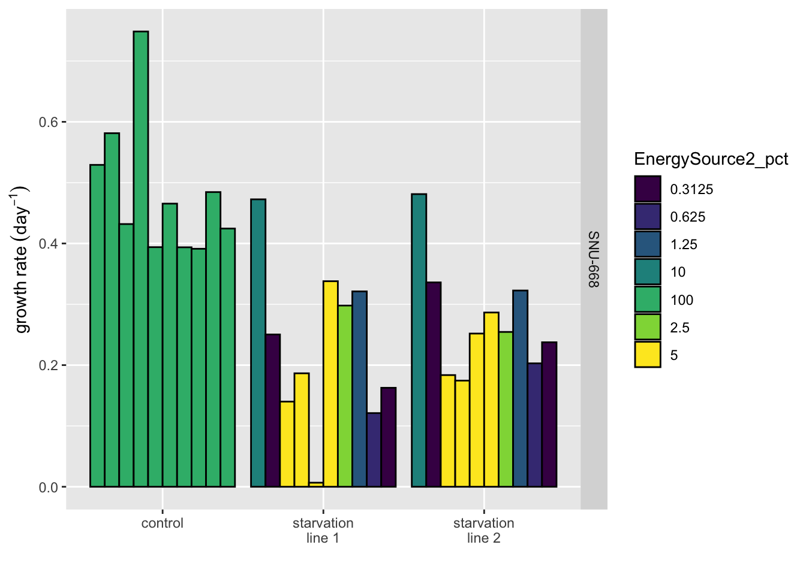
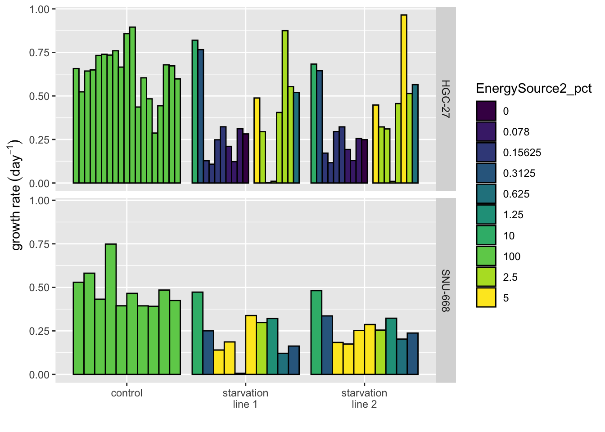

# Plotting Vignette

#### 2025-07-03

### Overview

For this tutorial, we will be examining the in-vitro cell count data for
gastric cancer cell lines (SNU-668 and HGC-27) grown in our lab. We will
be fitting exponential growth curves to the cell count data in order to
compare their growth dynamics. Cell counts come from CellPose segmented
images of the dishes under 10x magnification. Cells were cultured under
standard serum conditions (‘control’) or varying degrees of phosphate
deprivation (‘starvation line 1’ and ‘starvation line 2’).

We start by loading the plotting script. This contains three functions
that can produce the following plots: fitted growth curves, distribution
of growth rates by cell line and experimental condition, and the
distribution of growth rates over time. Full documentation here.

    ## The helper wraps all data access, filtering, and plotting in one call.
    source("experimentPlot_V2.R")

------------------------------------------------------------------------

Each chunk below **(a)** calls `experimentPlot_V2()` with a different
JSON parameter file **and** `db_creds.txt`, then **(b)** writes one or
more plots to the `output_path` specified inside that JSON.

> **Tip:** All five JSON files share the same base schema, output
> changes based on `plotting`, `filters`, `manual_filters`, or
> `facet_grid` entries.

## *Fit growth curve*

### Plot

Fit exponential growth curves to cell count data from in-vitro
experiments.

Input: json file with the first and last IDs for data sets in these
experiments, as well as all other required parameters.

Output: growth-curve plots in-line and saved to output directory in json
file.

    experimentPlot_V2("parameters_1.json", "db_creds.txt")

Plot shows the inferred daily cell counts (dots) and exponential growth
curve fit to the data. As we can see, the exponential growth model fits
the data well. This cell line shows moderate doubling time under control
conditions.

### Input JSON file

### *Fit multiple passages*

We can also examine multiple passages at a time.

    experimentPlot_V2("parameters_2.json", "db_creds.txt")

Here we can see passage 1 stayed in culture for one day longer than
passages 2 and 3, however, passage 2 shows the highest max population
reached in-vitro.

### *Facet plots by experimental condition*

You may want to compare fits across experiments conducted under varying
conditions.

    experimentPlot_V2("parameters_3.json", "db_creds.txt")

Here we can see the varying lengths of time each passage spent in
culture across experimental conditions. Starvation line 1 shows
inhibited growth in passage 8, starvation line 2 in passages 5-6 and 8.
Both starvation lines appear to be adjusting to reduced phosphate by
passage 10.

### *Check out growth rates*

Now let’s plot the distribution of growth rates from all passages across
phosphate levels.

    experimentPlot_V2("parameters_4.json", "db_creds.txt")

Here we can see diminished growth rate in the starvation lines across
most

### *Analyze multiple cell lines at once*

Finally, let’s compare the growth rates across conditions and cell
lines.

    experimentPlot_V2("parameters_5.json", "db_creds.txt")

------------------------------------------------------------------------
