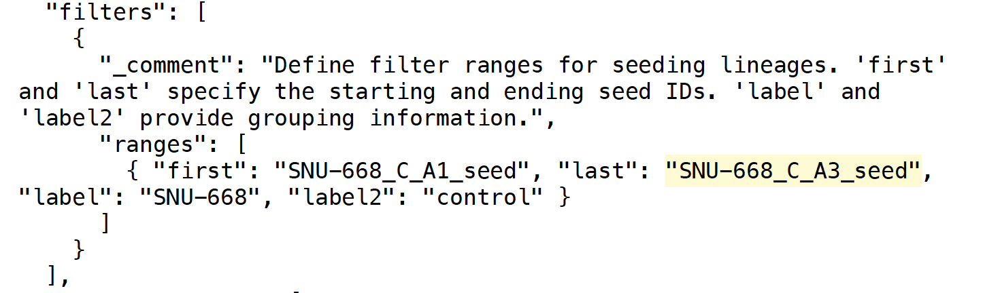
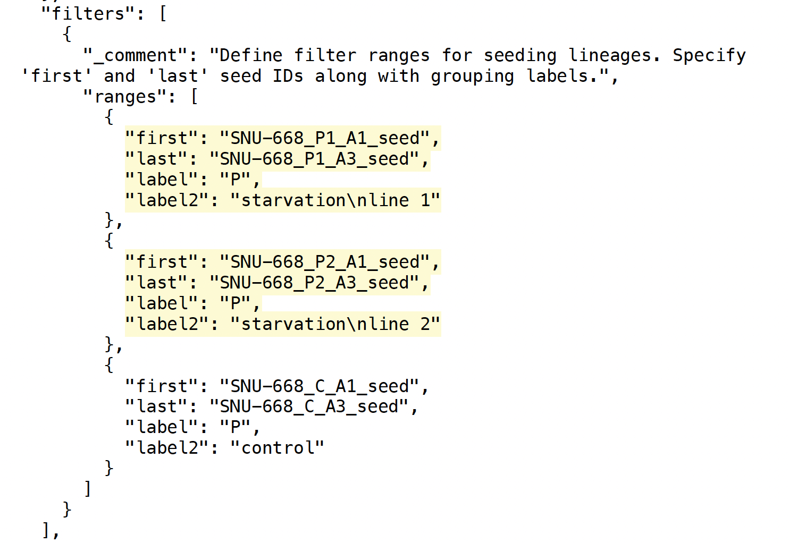
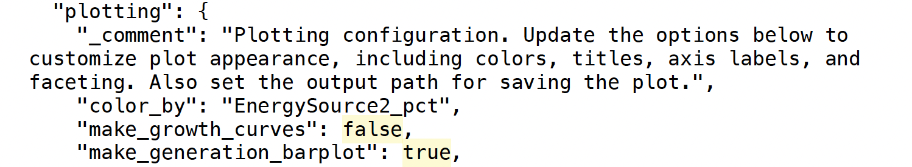
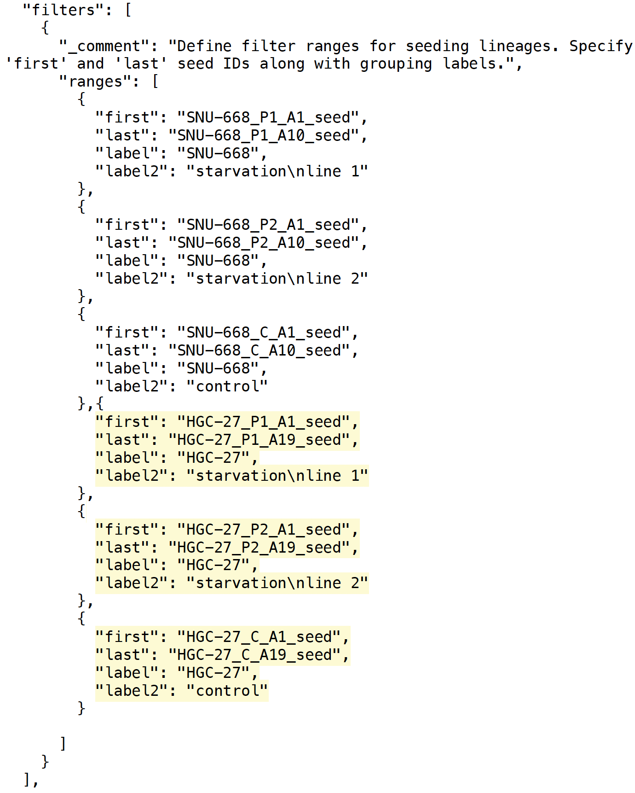

### Overview

For this tutorial, we will be examining the in-vitro cell count data for gastric cancer cell lines (SNU-668 and HGC-27) grown in our lab. We will be fitting exponential growth curves to the cell count data in order to compare their growth dynamics. Cell counts come from CellPose segmented images of the dishes under 10x magnification. Cells were cultured under standard serum conditions ('control') or varying degrees of phosphate deprivation ('starvation line 1' and 'starvation line 2').

```{r workflow-schematic, echo = FALSE, out.width = "100%"}
# knitr::include_graphics(sprintf("experimentPlot_V2_guide_Page_%d.png", 1:3))
```

```{r setup, include = FALSE}
## ────────────────────────────────────────────────────────────────
## Global chunk options
## ────────────────────────────────────────────────────────────────
knitr::opts_chunk$set(
  collapse = TRUE,          # Put code and output in the same block
  comment  = "#>",           # Prepend this to output lines
  warning = FALSE
)

## Tell knitr where to look for relative paths (e.g., JSON, scripts)
knitr::opts_knit$set(root.dir = "~/Repositories/ai-coding-integration-plan/cloneid_plotting_vignette")
```

We start by loading the plotting script. This contains three functions that can produce the following plots: fitted growth curves, distribution of growth rates by cell line and experimental condition, and the distribution of growth rates over time. Full documentation here.

```{r load-script}
## The helper wraps all data access, filtering, and plotting in one call.
source("experimentPlot_V2.R")
```

---

Each chunk below **(a)** calls `experimentPlot_V2()` with a different JSON
parameter file **and** `db_creds.txt`, then **(b)** writes one or more plots
to the `output_path` specified inside that JSON.

> **Tip:** All five JSON files share the same base schema, output changes
> based on `filters`, `manual_filters`, `plotting`, or `facet_grid`  entries.

## JSON schema

### **filters** `<array>`  
Each element defines a set of seed-ID ranges to include:

- **first** (`string`): Starting seed ID.  
- **last** (`string`): Ending seed ID.  
- **label** (`string`): Group label (e.g., cell line).  
- **label2** (`string`): Subgroup label (e.g., treatment condition).  

---

### **manual_filters** `<array>`  
Each object excludes rows by key/value:

- **key** (`string`): Column name to filter on (e.g., `"id"`, `"event"`).  
- **values** (`array[string]`): Values to drop (e.g., specific IDs or events such as `"seeding"`).  

---

### **plotting** `<object>`  
Controls which plots are drawn and how they look:

- **color_by** (`string`): Variable for color-coding (e.g., `"EnergySource_nM"`).  
- **make_growth_curves** (`boolean`): Draw exponential-fit curves?  
- **make_generation_barplot** (`boolean`): Draw generation barplots?  
- **make_passage_vs_growth** (`boolean`): Draw passage-vs-growth plots?  
- **facet_grid** (`object`): Options for faceted layouts:  
  - **rows** (`string`): Facet rows by this variable (e.g., `"sublabel_value"`).  
  - **cols** (`string`): Facet columns by this variable (e.g., `"adjPass"`).  
  - **scales** (`string`): Scale behavior—either `"free"` or `"fixed"`.  

## *Fit growth curve*  {.tabset}

### Plot

Fit exponential growth curves to cell count data from in-vitro experiments. 

```{r growth-curve}
experimentPlot_V2("input/parameters_1.json", "input/db_creds.txt")
```

Plot shows the inferred daily cell counts (dots) and exponential growth curve fit to the data. As we can see, the exponential growth model fits the data well. This cell line shows moderate doubling time under control conditions.

### Input JSON file

```{r json-1, echo=FALSE}
#knitr::include_graphics("input/JSON_1.pdf")
knitr::include_graphics(sprintf("input/JSON_1_Page_%d.png", 1:2))
```

## *Fit multiple passages* {.tabset}

### Plot

We can also examine multiple passages at a time by changing the "last" entry in the JSON file.
```{r multiple-passages, fig.width=14, fig.height=5}
experimentPlot_V2("input/parameters_2.json", "input/db_creds.txt")
```

Here we can see passage 1 stayed in culture for one day longer than passages 2 and 3.

### Input JSON file 2

```{r json-2, echo=FALSE}

```

## *Facet plots by experimental condition* {.tabset}

### Plot

You may want to compare fits across experiments conducted under varying conditions. In order to do this, we must add additional experiments to filters in the JSON file. We also switch the "color_by" variable from "label_value" to "EnergySource_Nm".

```{r facet-by-condition, fig.width=10, fig.height=7}
experimentPlot_V2("input/parameters_3.json", "input/db_creds.txt")
```

Here we can see the phosphate levels at time of seeding (color of fits) as well as the varying lengths of time each passage spent in culture across experimental conditions.

### Input JSON file 3

```{r json-3, echo=FALSE}

```


## *Check out growth rates*  {.tabset}

### Plot

Now let's plot the distribution of growth rates from all passages across phosphate levels. In order to see this, we must set "make_generation_barplot = TRUE".

```{r generation-barplot}
experimentPlot_V2("input/parameters_4.json", "input/db_creds.txt")
```

Here we can see diminished growth rate in the starvation lines across most 

### Input JSON file 4

```{r json-4, echo=FALSE}

```


## *Analyze multiple cell lines at once* {.tabset}

### Plot

Finally, let's compare the growth rates across conditions and cell lines. To do this, we need to add more cell lines to our filters section of the JSON file.
```{r multiple-cell-lines}
experimentPlot_V2("input/parameters_5.json", "input/db_creds.txt")
```

### Input JSON file 5

```{r json-5, echo=FALSE}

```

</div>

---

